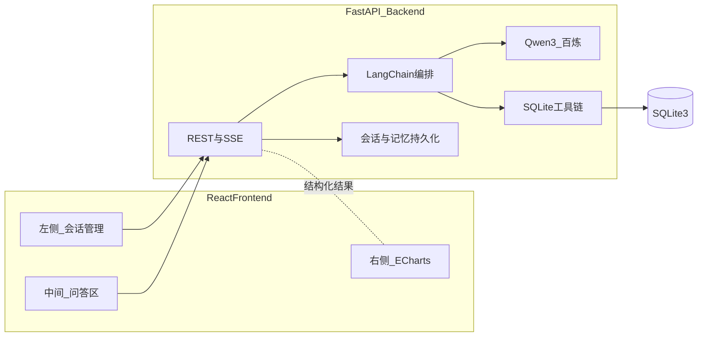
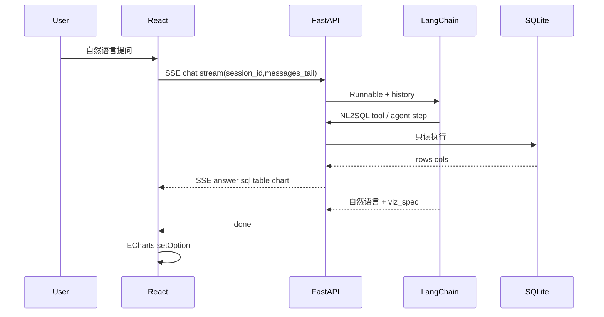
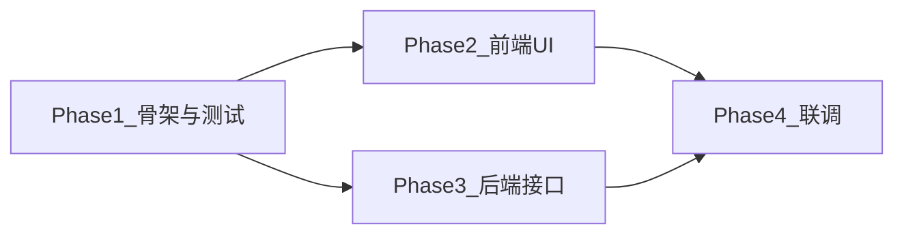

# 智能数据分析系统 — 项目总体规划

本文档为仓库内 **唯一完整计划**：**上半部**为需求、架构与 **§4 API/JSON/SSE/`viz_spec` 契约**；**§8** 为 Phase 目标与 DoD；**§12 附录** 为工单级可勾选清单（细分任务、Mock、P0/P1/P2）、与 §8 一一对应。契约变更时：先改 **§4** → OpenAPI/`schemas`/`types` → **§12** 中相关小节示例。

**约定简述**

| 条目 | 说明 |
|------|------|
| JSON 字段 | 统一 **snake_case**，与 §4、`VizSpec`、Pydantic 一致 |
| 健康检查 | **`GET /api/health`**（根路径别名可选其一写进 OpenAPI） |
| SSE 主方案 | `answer` / `sql` / `table` / `chart` / `done` / `error`，见 §4.6 |
| 记忆层 | **`RunnableWithMessageHistory` 与 `ChatService` 手工裁剪** 二选一，见 §4.4 |

---

## 1. 原始需求对齐

### 1.1 必须实现的功能

| 序号 | 功能 | 规划中对应章节 |
|:---:|------|----------------|
| 1 | 接入大模型 | §3.2、§5 |
| 2 | 基于自然语言查询数据库并返回最终结果 | §3.3、§4、§7 |
| 3 | 前端实时渲染可视化图表 | §4.5、§6、SSE `chart`/`done` §4.6 |

### 1.2 技术栈与框架约束

| 类别 | 选型 |
|------|------|
| 大模型 | 阿里云百炼 **Qwen3** |
| 后端框架 | **FastAPI** |
| LLM 编排 | **LangChain** |
| 数据库 | **SQLite3** |
| 后端能力 | **会话管理**、**上下文记忆** |
| 前端 | **React** |
| 布局 | **左**：聊天/会话管理；**中**：问答；**右**：可视化图表 |

### 1.3 已定设计决策（从规划评审继承）

| 决策项 | 选择 | 说明 |
|--------|------|------|
| 图表库 | **Apache ECharts**（如 `echarts-for-react`） | 能力覆盖折线、柱状、饼图、散点等 |
| 应答形态 | **REST + SSE** | `POST /api/chat`（非流式，可降级）；`POST /api/chat/stream`（流式正文） |
| 里程碑顺序 | **尽早 SSE** | Qwen3 与非流式 chat 打通后，优先接上 SSE；随后会话/记忆；再完整 `viz_spec` + ECharts |

---

## 2. 目标与边界

### 2.1 目标

端到端链路：**用户中文/自然语言提问 → LangChain Agent/链 调用 Qwen 生成只读 SQL → SQLite 执行 → 结构化表格 + LLM 或规则生成的 `viz_spec` → React 中区流式文案、右区图表刷新**。

### 2.2 边界与非目标（首版）

- 数据库：**只读**，禁止 DDL/DML（防误删与安全边界）。
- 鉴权与用户体系：可选用后续迭代；文档首版假定内网或可信任演示环境。
- 多租户多库：**可选**，API 预留 `database_id` 或配置项即可。

---

## 3. 总体架构

### 3.1 架构图



### 3.2 推荐目录骨架（从零搭建）

```text
DataAnalyticsSystem/
├── backend/
│   ├── app/
│   │   ├── main.py
│   │   ├── api/         # routes_*.py
│   │   ├── core/        # config, llm_factory
│   │   ├── chains/
│   │   ├── services/
│   │   ├── memory/
│   │   ├── db/
│   │   ├── schemas/
│   │   ├── models/
│   │   └── utils/
│   └── tests/
├── frontend/            # 建议 Vite + React + TypeScript
│   └── src/components/  # Sidebar, Chat, Viz, charts
├── data/                # analytics.db 或挂载路径
├── docs/                # 本目录，设计文档
└── README.md
```

---

## 4. 后端模块

### 4.1 API 网关（FastAPI）

| 方法与路径 | 说明 |
|------------|------|
| `GET /api/health` | 就绪探针，示例 `{ "status": "ok" }` |
| `POST /api/chat` | 非流式；**响应体**见 §4.7（`session_id`、`message_id`、`answer`、`sql`、`table`、`viz_spec`）；用于调试与降级 |
| `POST /api/chat/stream` | **SSE**，事件模型见 **§4.6（主方案）** |
| `GET /api/sessions` | 会话列表 |
| `POST /api/sessions` | 创建会话 |
| `GET /api/sessions/{session_id}/messages` | 拉取某会话历史消息 |
| `PATCH /api/sessions/{session_id}` | 更新标题等 |
| `DELETE /api/sessions/{session_id}` | 删除（级联清除消息按需） |
| `GET /api/query/{job_id}` | （可选）大数据分页，与 `viz_spec.data_ref=job` 配套 |

**职责**：校验入参、`session_id` 绑定、CORS（生产限制来源）、错误体统一（含 SQL 被拒、超限、超时）。

### 4.2 LLM 接入（阿里云百炼 · Qwen3）

- 环境变量：与 **§12** 环境变量小节一致建议使用 **`DASHSCOPE_API_KEY`**、**`DASHSCOPE_BASE_URL`**、**`QWEN_MODEL`**（及 `SQLITE_DB_PATH` 等），在 **`app/core/config.py`** / Pydantic `Settings` 中加载。
- LangChain：**OpenAI 兼容 Chat 端点** + `ChatOpenAI`，或 **`dashscope` / LangChain Community 适配器**——以阿里云当前官方兼容方式为准，封装为 **`llm_factory()`**。
- Key **不得**写进仓库、**不得**回传浏览器。

### 4.3 数据库与自然语言查询（SQLite3 + LangChain）

- **能力**：生成 **SELECT**（含聚合、JOIN、CTE，视产品与提示词约束）。
- **只读强制执行**：单独连接 URI、`check_same_thread`，并在执行前后或工具层拦截 `INSERT`/`UPDATE`/`DELETE`/`DROP`/`PRAGMA` 等危险前缀。
- **Schema 提示**：向系统提示注入 `CREATE TABLE` 摘要或自动 introspection，减少列名幻觉。
- **结果**：`(columns: list[str], rows: list[list])` 或 DataFrame；**硬上限**：最大行数/最大字节，超限截断或要求用户收窄问题。

### 4.4 会话管理与上下文记忆

| 维度 | 实现要点 |
|------|----------|
| 会话维度 | SQLite 表 `sessions`：`id`（uuid）、`title`、`created_at`；首轮用户话可自动生成短标题 |
| 消息维度 | 表 `messages`：`session_id`、`role`、`content`、`created_at`；可选附带 `tool_calls`/`sql_executed` 元数据 JSON |
| LangChain 集成 | **`RunnableWithMessageHistory`**，`get_session_history(session_id)` 从 DB 读写 |
| 记忆预算 | **窗口截断**或异步 **会话摘要**：不要把完整大结果塞进下一轮上下文；优先携带「最近一条 SQL + 简短统计描述 + 当前问题」 |
| **实现注意** | **`RunnableWithMessageHistory` 与 `ChatService` 内手动裁剪历史请勿叠用**，择一作主路径，避免重复计入 token 或状态分叉 |

### 4.5 可视化契约 `viz_spec`（后端核心）

完成 SQL 与表格结果后，由 **`VizService`（规则优先）** 或与 LLM 结构化输出结合，生成前端可解释的 JSON。字段 **一律 snake_case**，与 `POST /api/chat` 响应及前端 TypeScript 类型对齐。

```json
{
  "chart_type": "bar|line|pie|scatter|table",
  "title": "可选图表标题",
  "x_field": "横轴或类目列名",
  "y_field": "纵轴或数值列名",
  "category_field": "可选分组/系列列名",
  "value_field": "可选饼图数值列名",
  "data_ref": "inline|job",
  "meta": { "row_count": 0, "truncated": false }
}
```

- **`chart_type=table` 或 `viz_spec=null`**：右区以表格为主或空态，不强制出图。
- **`data_ref=inline`**：`POST /api/chat` 的 **`table.rows`** 已与图共用；流式场景下由 `table` / `chart` 事件先后推送（§4.6）。
- **`data_ref=job`**：大图走 `GET /api/query/{job_id}?page=`（首版可选）。
- 前端 **只渲染约定字段**，禁止将任意 JSON 当可执行代码执行。

### 4.6 SSE 事件约定（实现阶段写死一种主方案）

**主方案（推荐）**：与 §12 中联调条目一致——按阶段推送，便于中间区展示 SQL/表格、右区独立刷图。

| SSE `event` | `data`（JSON）要点 | 语义 |
|-------------|-------------------|------|
| `answer` | `content` 片段或可合并的多段 | 中区助手正文（可流式多段） |
| `sql` | `sql` | 展示 `SQLBlock` |
| `table` | `columns`, `rows` | 展示 `ResultTable` |
| `chart` | `viz_spec` | 右区 **ECharts** `setOption` |
| `done` | `session_id`, `message_id`, … | 关闭 loading、可选落库对齐 |
| `error` | `message`, 可选 `code` | 展示错误并结束流 |

**备选方案**：仅推 `token`（文本增量）+ 末尾一次 `done`（内含完整 `answer`/`sql`/`table`/`viz_spec`）。团队若选备选，须在 OpenAPI/SSE 说明中标注，前端只实现其一。

### 4.7 `POST /api/chat` 响应体（非流式）

与 **§12** 中 Mock / `ChatResponse` 示例对齐：

```json
{
  "session_id": "s_001",
  "message_id": "m_001",
  "answer": "自然语言结论",
  "sql": "SELECT ...",
  "table": {
    "columns": ["col_a", "col_b"],
    "rows": [{"col_a": 1, "col_b": "x"}]
  },
  "viz_spec": { "chart_type": "bar", "x_field": "col_a", "y_field": "col_b" }
}
```

---

## 5. 前端模块（React）

### 5.1 布局

- **左侧（约 240–280px）**：会话列表、`+ 新建`、`localStorage` 记录上一次 `sessionId`，与后端同步。
- **中间（flex:1）**：消息列表（用户 / 助手）、SSE 打字效果、可折叠区块展示 **本条 SQL / 耗时 / 影响行（SELECT 为扫描行可读）**。
- **右侧（约 360–440px，可拖拽）**：依据 `viz_spec.chart_type`（及字段映射）路由到 ECharts；缺省为空状态 **或** 表格视图。
- （可选）路由 `/:sessionId` 直达会话。

### 5.2 数据与实时性

- 使用 **`fetch` + `ReadableStream` 解析 SSE**（或原生 `EventSource` 仅在 GET 适配时）。
- **主方案 SSE**：按事件更新 UI——`answer` 拼正文，`sql`/`table` 更新中间区，`chart` 携带 `viz_spec` 触发右区 **整块重绘**；`done` 收尾。
- **备选 SSE**：仅 `token` + 最终 `done` 大包时，在 `done` 后一次性刷新三处状态。

可选：`@tanstack/react-query` 管理会话列表与历史消息缓存。

---

## 6. 横切关注点

| 类别 | 内容 |
|------|------|
| 安全 | DB 路径白名单；服务端持有 Key；CORS 收紧；SQLite 参数化查询防拼接注入 |
| 可观测 | 结构化日志：`session_id`、哈希后的 SQL、latency、truncation 标记 |
| 配置 | `backend/.env`、`frontend/.env.development` 中的 `VITE_API_BASE_URL` |
| LangSmith | 可选，仅开发启用 |

---

## 7. 数据流简述



---

## 8. 分阶段实施（Phase）

以下四阶段对应你提出的交付节奏：**先可运行的工程骨架与测试 → 前端 UI → 后端真实接口 → 前后端联调**。与纯技术依赖路径（先 API 后 UI）不一致时，通过在 **Phase 2 使用 Mock/固定数据** 消解阻塞；**Phase 4** 再做真实对接与验收。



说明：Phase 2 与 Phase 3 均在 Phase 1 之后**可并行**；**人力排期**建议仍按「先 Phase 2 UI 壳子 + Mock，再 Phase 3 补全实现」以减少返工；若严格按你给出的顺序，则 **顺序执行 Phase 2 → Phase 3**，联调集中在 Phase 4。

### Phase 1 — 搭建前后端基础框架并跑通测试

| 工作项 | 后端（FastAPI） | 前端（Vite + React + TS） |
|--------|----------------|---------------------------|
| 工程初始化 | `pyproject.toml` 或 `requirements.txt`、虚拟环境、入口 `main.py`、包结构 `api/`、`schemas/` | `npm create vite@latest`、TypeScript、路径别名可选 |
| 最小可运行能力 | `GET /api/health` 返回 `{"status":"ok"}`；CORS 放开开发源；`/.env.example` 列出后续变量占位 | 首页可启动；`VITE_API_BASE_URL` 占位 |
| 自动化测试 | **`pytest`**：`TestClient` 请求 `/api/health` 断言 200；可选 `ruff`/`mypy` | **`vitest` + `RTL`** 或 **`npm run build`** 作为 CI 门槛；对根组件 smoke |
| 仓库级脚本 | `Makefile` 或 `scripts/`：`test-backend`、`test-frontend`（或根 `README` 中写明命令） | 同左 |
| SQLite / 数据目录 | 预留 `data/` 与配置项；可提交 **空库** 或 **种子 SQL**（表结构），**不必**接入 LangChain | 无 |

**Phase 1 退出准则（DoD）**：本地或 CI 中 **后端测试通过**、**前端 build（及若有的单测）通过**；两进程（或 docker-compose 可选）可同时启动，浏览器能打开前端（即使仍空白占位页）。

### Phase 2 — 研发前端 UI（与 Mock 数据）

| 工作项 | 说明 |
|--------|------|
| 三栏布局 | 左 / 中 / 右 区域、响应式或可选侧栏宽度；全局字体与主题与现有设计一致即可 |
| 左侧 | 会话列表、新建会话按钮、选中态；数据来自 **内存或 MSW/mock JSON** |
| 中间 | 消息气泡、输入框、发送交互；**SSE 区**可用 `ReadableStream` 读 **本地 mock 事件** 模拟 token 拼接 |
| 右侧 | **ECharts** 挂载；先用 **静态 `option` 或与 `viz_spec` 同形的假数据** 验证折线/柱状/空态 |
| API 层 | 封装 `apiClient`：`fetch` baseURL、错误处理；对 `POST /api/sessions`、`/api/chat/stream` 等 **打桩** |
| 路由 | 可选 `/:sessionId` |

**Phase 2 退出准则**：不启动真实后端（或仅 Phase 1 的 `/api/health`）即可 **完整走通 UI 与图表刷新（假数据）**；布局与状态划分（会话 store、viz state）达成一致。

### Phase 3 — 实际研发后端接口

按 [§4](#4-后端模块) 实现（可在此阶段才引入 LangChain / 百炼 Key）：

| 顺序建议 | 内容 |
|----------|------|
| 1 | SQLite 只读封装、schema 注入、`sessions` / `messages` 持久化 |
| 2 | **`llm_factory()`**、Qwen3 联通；NL2SQL Agent/链与行数上限 |
| 3 | `POST /api/chat` 非流式端到端 |
| 4 | **`POST /api/chat/stream`（SSE）**：实现 **§4.6 主方案**（或书面选定备选） |
| 5 | **`viz_spec` 生成**与 OpenAPI / Pydantic 对齐 **§4.5–§4.7** |

**Phase 3 退出准则**：用 **httpx/async 集成测试** 或 **手动 `curl`/OpenAPI** 可验证：会话 CRUD、一次性 chat、流式 chat（无前端亦可）；需 Key 的测试用 `@pytest.mark.integration` 跳过或夜间跑。

**阶段性进展（已通过当前仓库测试的子集）：** 百炼 **`ChatOpenAI` + 兼容 `/v1`** 已接通；`pytest`（含配置了 `DASHSCOPE_API_KEY` 时的 **`@pytest.mark.integration`**）通过。NL2SQL 采用 **`SQLDatabaseToolkit` + LangGraph `create_react_agent`**（见 `app/services/nl2sql.py`），探针 **`scripts/qwen3_max_api_probe_local.py`** 可核对 **流式 `delta.tool_calls` 拼接**与非流 **`finish_reason=tool_calls`**；响应中可能出现 **`reasoning_content`**、`usage` 内的 **`reasoning_tokens`**（OpenAI 兼容扩展字段）。**上述不计入 Phase 3 全量 DoD：** `POST /api/chat`、`POST /api/chat/stream`、SQLite 级别 **SQLGuard**、**sessions/messages** 持久化与 CRUD、`viz_service` 等仍为 **§12** 勾选待办。

### Phase 4 — 前后端联调

| 工作项 | 说明 |
|--------|------|
| 环境 | 前端 `.env.development` 指向真实后端；CORS 与白名单域名核对 |
| SSE | 订阅 `answer`/`sql`/`table`/`chart`/`done`/`error`；**断线重试**；与落库展示一致 |
| `viz_spec` | 右区按 **`chart_type` + 字段映射** 渲染；表格 fallback、空态、`meta.truncated` |
| 会话 | 刷新页面后列表与历史与后端一致（或明确仅内存则写进 DoD 例外） |
| 回归 | 跑 Phase 1 **全量测试** + 可选 **Playwright** 一条「发消息 → 出图」冒烟 |

**Phase 4 退出准则**：端到端满足 §1.1 所列三条必须能力；已知问题写入 issue/备注。


### 8.1 Phase 与附录对应

- **§8** 上表表述各 Phase **目标 / DoD**。  
- **§12** 为 **逐项 `- [ ]` 清单**，按 Phase 1.x～4.x、Prio、最简顺序展开；开发与 Daily 勾选以 §12 为准。


---

## 9. 实施里程碑（技术依赖向，与 Phase 对照）

以下按**技术耦合**排列，用于拆任务与估时；执行顺序以 **§8 Phase** 为管理节奏。

| 技术步骤 | 主要内容 | 主要落在 Phase |
|----------|----------|----------------|
| 1 | FastAPI、SQLite **只读**、最小 `SQLDatabase`/工具、`POST /api/chat` 表格 JSON | **1 → 3** |
| 2 | 百炼 Qwen3、`llm_factory()`、NL2SQL 串联（**Toolkit + LangGraph Agent 已就位**） | **3**（端到端 **`/api/chat`** 收口仍待 §12 `3.17–3.19`） |
| 3 | **`/api/chat/stream`（SSE）**、§4.6 主方案事件 | **3**（细节可在 Phase 4 与前端收口） |
| 4 | **`sessions` / `messages`、`RunnableWithMessageHistory`、裁剪** | **3** |
| 5 | **`viz_spec` 与 ECharts 契约对齐** | **3–4** |
| 6 | 增强：分页 job、会话摘要、多库、鉴权 | 后续迭代 |

**对照小结**：Phase 1 = 工程 + 测试门槛；Phase 2 = UI + Mock；Phase 3 = 本表后端能力落实；Phase 4 = 联调与本表第 5–6 项收口。

---

## 10. 风险与缓解

| 风险 | 缓解 |
|------|------|
| SQL 幻觉/错误 | Schema 注入、只允许 SELECT、`EXPLAIN` 预检可选、失败后把错误回填 LLM **有限次** 重试 |
| 大结果内存与响应 | LIMIT、服务端 max rows、分页 `job`、`truncated:true` |
| SSE 断开 | 前端重试、「最后一条占位消息」复原；服务端短超时与幂等 `session_id` |

---

## 11. 文档维护

- **契约变更**：§4 → 后端 OpenAPI/`schemas` → 前端 `types` → §12 中 Mock / SSE / 示例 JSON。
- **唯一文档**：请勿再拆分第二份总体规划；若在 Cursor / 外链有摘要，请以本文件为准同步。

---

## 12. 附录：工单级 To-do 全文（可勾选）

> 以下工单清单与 §8 Phase 对齐。Markdown 勾选：`- [ ]` / `- [x]`。
============================================================
Phase 1：前后端基础框架搭建与测试
============================================================

目标：
先把前端、后端、数据库、测试环境跑起来。
这一阶段不做复杂业务逻辑，只验证工程基础可用。

------------------------------------------------------------
1.1 后端基础工程搭建
------------------------------------------------------------

- [ ] 初始化后端项目目录
- [ ] 创建 FastAPI 项目
- [ ] 创建 app/main.py
- [ ] 创建后端基础目录结构
- [ ] 配置 FastAPI 启动入口
- [ ] 配置 CORS，允许前端访问后端
- [ ] 配置统一异常处理
- [ ] 配置日志输出
- [ ] 配置 .env 环境变量文件
- [ ] 配置环境变量读取模块 config.py

建议后端目录结构：

backend/
  app/
    main.py
    api/
    core/
    db/
    services/
    chains/
    memory/
    schemas/
    models/
    utils/
  tests/

------------------------------------------------------------
1.2 后端依赖安装
------------------------------------------------------------

- [ ] 安装 FastAPI
- [ ] 安装 Uvicorn
- [ ] 安装 LangChain
- [ ] 安装 langchain-openai
- [ ] 安装 SQLite 相关依赖
- [ ] 安装 Pydantic
- [ ] 安装 pytest
- [ ] 安装 python-dotenv

------------------------------------------------------------
1.3 环境变量配置
------------------------------------------------------------

.env 中建议预留：

DASHSCOPE_API_KEY=your_api_key
DASHSCOPE_BASE_URL=https://dashscope.aliyuncs.com/compatible-mode/v1
QWEN_MODEL=qwen3_xxx

SQLITE_DB_PATH=./data/app.db
APP_ENV=dev

To-do：

- [ ] 配置阿里云百炼 API Key
- [ ] 配置阿里云百炼 Base URL
- [ ] 配置 Qwen3 模型名称
- [ ] 配置 SQLite3 数据库路径
- [ ] 配置后端运行环境
- [ ] 确认敏感信息不提交到 Git

------------------------------------------------------------
1.4 后端健康检查接口
------------------------------------------------------------

- [ ] 创建 routes_health.py
- [ ] 实现 /api/health
- [ ] 返回服务状态
- [ ] 浏览器访问 /api/health 成功
- [ ] Postman / Apifox 测试成功

示例返回：

{
  "status": "ok"
}

------------------------------------------------------------
1.5 SQLite3 基础连接测试
------------------------------------------------------------

- [ ] 准备 SQLite3 示例数据库
- [ ] 创建 app/db/sqlite.py
- [ ] 实现数据库连接方法
- [ ] 实现只读连接模式
- [ ] 测试能否连接数据库
- [ ] 测试能否读取表名
- [ ] 测试能否执行简单 SELECT
- [ ] 确认不执行写入操作

------------------------------------------------------------
1.6 后端基础测试
------------------------------------------------------------

- [ ] 配置 pytest
- [ ] 创建 tests/test_health.py
- [ ] 测试 /api/health
- [ ] 创建 tests/test_sqlite_connection.py
- [ ] 测试 SQLite3 是否能连接
- [ ] 测试 SQLite3 是否能读取表结构
- [ ] 运行全部测试
- [ ] 确认 pytest 全部通过

------------------------------------------------------------
1.7 前端基础工程搭建
------------------------------------------------------------

- [ ] 初始化 React 项目
- [ ] 创建前端基础目录结构
- [ ] 创建主页面 DataAnalysisPage
- [ ] 创建前端入口路由
- [ ] 配置基础样式
- [ ] 配置 API 请求工具
- [ ] 配置环境变量，例如后端 API 地址

建议前端目录结构：

frontend/
  src/
    api/
    components/
    pages/
    types/
    utils/
    styles/

------------------------------------------------------------
1.8 前端基础启动测试
------------------------------------------------------------

- [ ] 启动 React 项目
- [ ] 浏览器能正常打开页面
- [ ] 页面无报错
- [ ] 前端能请求 /api/health
- [ ] 前后端基础通信成功

------------------------------------------------------------
Phase 1 验收清单
------------------------------------------------------------

- [ ] FastAPI 可以正常启动
- [ ] React 可以正常启动
- [ ] /api/health 返回正常
- [ ] SQLite3 可以连接
- [ ] 后端基础测试通过
- [ ] 前端可以访问后端健康检查接口


============================================================
Phase 2：前端 UI 研发
============================================================

目标：
先不接真实后端，用 Mock 数据完成前端页面和交互。

前端布局：
左侧：聊天管理
中间：问答区域
右侧：可视化图表展示

------------------------------------------------------------
2.1 前端三栏布局
------------------------------------------------------------

- [ ] 创建 DataAnalysisPage
- [ ] 创建整体布局容器
- [ ] 实现左中右三栏结构
- [ ] 左侧固定宽度
- [ ] 中间区域自适应
- [ ] 右侧图表区域固定或可调宽度
- [ ] 设置页面高度为全屏
- [ ] 处理滚动区域
- [ ] 添加基础响应式适配

页面结构：

DataAnalysisPage
  ├── Sidebar
  ├── ChatPanel
  └── ChartPanel

------------------------------------------------------------
2.2 左侧聊天管理 UI
------------------------------------------------------------

组件：
Sidebar
SessionList
SessionItem
NewSessionButton

To-do：

- [ ] 创建 Sidebar
- [ ] 创建 SessionList
- [ ] 创建 SessionItem
- [ ] 创建 NewSessionButton
- [ ] 使用 Mock 数据展示会话列表
- [ ] 支持新建 Mock 会话
- [ ] 支持切换 Mock 会话
- [ ] 支持删除 Mock 会话
- [ ] 当前会话高亮
- [ ] 无会话时显示空状态

------------------------------------------------------------
2.3 中间问答区域 UI
------------------------------------------------------------

组件：
ChatPanel
MessageList
MessageBubble
ChatInput
SQLBlock
ResultTable

To-do：

- [ ] 创建 ChatPanel
- [ ] 创建 MessageList
- [ ] 创建 MessageBubble
- [ ] 创建 ChatInput
- [ ] 创建 SQLBlock
- [ ] 创建 ResultTable
- [ ] 展示用户消息
- [ ] 展示 AI 回答
- [ ] 展示 SQL
- [ ] 展示查询表格
- [ ] 输入框支持提交
- [ ] 支持 Enter 发送
- [ ] 支持 Shift + Enter 换行
- [ ] 支持 Loading 状态
- [ ] 支持错误提示
- [ ] 支持空状态

------------------------------------------------------------
2.4 右侧图表展示 UI
------------------------------------------------------------

组件：
ChartPanel
EChartsRenderer
ChartEmptyState

To-do：

- [ ] 安装 ECharts
- [ ] 创建 ChartPanel
- [ ] 创建 EChartsRenderer
- [ ] 创建 ChartEmptyState
- [ ] 使用 Mock 数据渲染柱状图
- [ ] 使用 Mock 数据渲染折线图
- [ ] 使用 Mock 数据渲染饼图
- [ ] 无图表时显示空状态
- [ ] 图表数据变化时自动刷新

------------------------------------------------------------
2.5 前端类型定义
------------------------------------------------------------

建议创建：

src/types/chat.ts
src/types/session.ts
src/types/chart.ts

To-do：

- [ ] 定义 ChatRequest
- [ ] 定义 ChatResponse
- [ ] 定义 Session
- [ ] 定义 Message
- [ ] 定义 TableData
- [ ] 定义 VizSpec
- [ ] 定义 ChartType

示例：

export type ChartType = "bar" | "line" | "pie" | "scatter" | "table";

export interface VizSpec {
  chart_type: ChartType;
  title?: string;
  x_field?: string;
  y_field?: string;
  category_field?: string;
  value_field?: string;
}

------------------------------------------------------------
2.6 Mock 数据契约
------------------------------------------------------------

- [ ] 编写 Mock 会话列表
- [ ] 编写 Mock 消息列表
- [ ] 编写 Mock Chat Response
- [ ] 编写 Mock Table Data
- [ ] 编写 Mock Viz Spec
- [ ] 用 Mock 数据跑通完整页面

Mock 返回结构：

{
  "session_id": "s_001",
  "message_id": "m_001",
  "answer": "最近30天销售额最高的产品是 A 产品。",
  "sql": "SELECT product_name, SUM(amount) AS sales_amount FROM sales GROUP BY product_name ORDER BY sales_amount DESC LIMIT 10;",
  "table": {
    "columns": ["product_name", "sales_amount"],
    "rows": [
      {
        "product_name": "A产品",
        "sales_amount": 12000
      },
      {
        "product_name": "B产品",
        "sales_amount": 8000
      }
    ]
  },
  "viz_spec": {
    "chart_type": "bar",
    "title": "产品销售额对比",
    "x_field": "product_name",
    "y_field": "sales_amount"
  }
}

------------------------------------------------------------
2.7 ECharts Option 转换函数
------------------------------------------------------------

- [ ] 创建 buildEChartsOption.ts
- [ ] 接收 viz_spec
- [ ] 接收 table.rows
- [ ] 转换为 ECharts option
- [ ] 支持 bar
- [ ] 支持 line
- [ ] 支持 pie
- [ ] 不支持的图表类型返回空状态

------------------------------------------------------------
Phase 2 验收清单
------------------------------------------------------------

- [ ] 前端三栏布局完成
- [ ] 左侧会话管理 UI 完成
- [ ] 中间问答区域 UI 完成
- [ ] 右侧图表展示 UI 完成
- [ ] Mock 问答流程可以跑通
- [ ] Mock 表格可以展示
- [ ] Mock 图表可以渲染
- [ ] 前后端数据契约初步确定


============================================================
Phase 3：后端接口实际研发
============================================================

目标：
在 LangChain 框架下接入 Qwen3，完成 NL2SQL、SQLite3 查询、会话记忆、图表配置生成。

核心链路：

FastAPI
→ ChatService
→ LangChain Qwen3 ChatModel
→ LangChain SQLDatabase
→ NL2SQL Chain
→ SQLGuard
→ SQLite3
→ AnswerChain
→ VizService
→ 返回结果

**当前仓库已落地的 Phase 3 子集（与下方 §12 `3.*` 勾选对应）：** `requirements.txt` 已引入 `langchain` / `langchain-openai` / `langchain-community` / `langgraph`；`backend/.env` + `app/core/config.py` 读取 **`DASHSCOPE_API_KEY`、Base URL、`QWEN_MODEL`、`QWEN_TEMPERATURE`**；`app/core/llm_factory.py` 导出 **`ChatOpenAI`**；`app/db/langchain_sql.py` 封装 **`SQLDatabase`** URI；**`app/services/nl2sql.py`** 拼装 **SQLToolkit + ReAct Agent**；**`tests/test_langchain_integration.py`**、`scripts/langchain_integration_check.py`、 **`scripts/qwen3_max_api_probe_local.py`** 用于回归与字段探针。**仍待：** `routes_chat` / SSE、`sqlite` 执行层 **`SQLGuard`**、会话表、`viz_service`/`answer_chain` 与 OpenAPI §4 全对齐等。

------------------------------------------------------------
3.1 LangChain 模型适配层：接入百炼 Qwen3
------------------------------------------------------------

说明：
Qwen3 不是单独裸调 API，而是封装成 LangChain 的 ChatModel。

To-do：

- [x] 安装 langchain-openai
- [x] 创建 app/core/llm_factory.py
- [x] 使用 ChatOpenAI 封装百炼 Qwen3
- [x] 从 .env 读取 DASHSCOPE_API_KEY
- [x] 从 .env 读取 DASHSCOPE_BASE_URL
- [x] 从 .env 读取 QWEN_MODEL
- [x] 设置 temperature
- [x] 设置 timeout
- [x] 设置是否开启 streaming（工厂支持 `streaming` 参数）
- [x] 返回 LangChain ChatModel 实例

示例结构：

from langchain_openai import ChatOpenAI
from app.core.config import settings

def llm_factory(streaming: bool = False):
    return ChatOpenAI(
        api_key=settings.DASHSCOPE_API_KEY,
        base_url=settings.DASHSCOPE_BASE_URL,
        model=settings.QWEN_MODEL,
        temperature=0,
        streaming=streaming,
    )

------------------------------------------------------------
3.2 LangChain Qwen3 接入测试
------------------------------------------------------------

建议创建：
tests/test_llm_factory.py  
（已实现合并进 `tests/test_langchain_integration.py`）

To-do：

- [x] 测试 llm_factory() 能创建模型实例
- [x] 测试 llm.invoke("只回复 OK")（integration，需 Key；无 Key 跳过）
- [x] 测试模型返回内容不为空（同上）
- [x] 测试错误 API Key 时能返回清晰错误（缺省时 `ValueError`，非 HTTP 语义）
- [ ] 测试 streaming 模式是否可用（待专门用例或通过探针脚本手验）

验收：
Qwen3 可以通过 LangChain 的 ChatModel 正常调用。

------------------------------------------------------------
3.3 LangChain SQLDatabase 接入 SQLite3
------------------------------------------------------------

建议创建：
app/db/sql_database.py  
（**当前实现：** `app/db/langchain_sql.py`，后续可更名与规划文件名对齐）

To-do：

- [x] 封装 SQLite3 数据库 URI
- [ ] 使用只读模式连接 SQLite3（**待**执行层 URI `mode=ro` 或服务端 SQLGuard）
- [x] 创建 LangChain SQLDatabase
- [x] 获取数据库表名
- [x] 获取数据库 schema
- [ ] 限制可访问表范围
- [x] 测试基础 SELECT 查询（经 Toolkit / 集成路径）

示例目标：

db = get_sql_database()
tables = db.get_usable_table_names()

------------------------------------------------------------
3.4 SQLDatabase 测试
------------------------------------------------------------

建议创建：
tests/test_sql_database.py  
（**当前：** `tests/test_langchain_integration.py` 中与 SQLDatabaseToolkit 等价覆盖）

To-do：

- [x] 测试 SQLDatabase 是否能创建
- [x] 测试是否能读取 table names
- [ ] 测试是否能读取 table schema（Toolkit 按需拉取）
- [x] 测试是否能执行 SELECT（由 Agent 工具路径）
- [ ] 测试写操作是否被禁止

验收：
LangChain SQLDatabase 可以安全读取 SQLite3。

------------------------------------------------------------
3.5 NL2SQL Chain 构建
------------------------------------------------------------

建议创建：
app/chains/nl2sql_chain.py  
（**当前：** `app/services/nl2sql.py`：**SQLDatabaseToolkit** + **`create_react_agent`**；Tutorial 所用 `langchain.agents.create_agent` 在本仓库 PyPI `langchain<0.4` 上不可用。）

To-do：

- [x] 使用 llm_factory() 获取 Qwen3 ChatModel
- [x] 使用 get_sql_database() 获取 SQLDatabase（`get_langchain_sql_database()` / URI 构造）
- [x] 构建 NL2SQL Chain（等价：ReAct Agent + SQL 工具链）
- [ ] 将用户自然语言问题输入 Chain（**待**接入 `ChatService` / HTTP）
- [x] 让 Chain 基于 schema 生成 SQL（工具能力已具备）
- [ ] 提取 SQL 字符串（**待**：从首轮 API 应答或 Agent 状态中固化）
- [ ] 清理模型输出中的 markdown 代码块
- [ ] 清理多余解释文本
- [ ] 返回标准 SQL

链路：

question
→ Qwen3 ChatModel
→ SQLDatabase schema
→ SQL query

------------------------------------------------------------
3.6 NL2SQL Prompt 设计
------------------------------------------------------------

To-do：

- [x] 设计系统提示词（Agent `system_prompt` 初稿，含 DML 禁止、LIMIT、`sql_db_query_checker` 引导）
- [x] 明确只允许生成 SQLite 语法（措辞已含 dialect）
- [x] 明确只允许生成 SELECT（禁止 DDL/DML）
- [x] 明确必须添加 LIMIT（prompt 中带 `top_k`）
- [x] 明确不能编造表名和字段名（要求先列表明 / 模式）
- [ ] 明确输出只包含 SQL（Agent 范式下为多轮工具调用而非纯文本 SQL）
- [x] 支持中文自然语言问题
- [ ] 支持多轮上下文补充（待 RunnableWithMessageHistory / ChatService）

Prompt 约束示例：

你是一个数据分析 SQL 助手。
你只能基于给定的数据库 schema 生成 SQLite 查询。
只能生成 SELECT 语句。
不要生成 INSERT、UPDATE、DELETE、DROP、ALTER。
不要解释 SQL。
只输出 SQL。

------------------------------------------------------------
3.7 NL2SQL 测试
------------------------------------------------------------

建议创建：
tests/test_nl2sql_chain.py  

To-do：

- [ ] 测试普通统计问题能生成 SQL（**待**：带 Key 的端到端 Agent `invoke`，或 Mock LLM）
- [ ] 测试分组统计问题能生成 SQL
- [ ] 测试时间筛选问题能生成 SQL
- [ ] 测试不存在字段时返回错误
- [ ] 测试模型输出是否只包含 SQL
- [ ] 测试生成 SQL 是否为 SQLite 语法
- [ ] 测试多轮追问问题
- [x] Agent 编译烟测：`build_nl2sql_agent`（Mock `bind_tools`）见 `test_langchain_integration.py`

验收：
自然语言问题可以通过 LangChain + Qwen3 生成 SQL。

**探针**：`scripts/qwen3_max_api_probe_local.py` 已校验 **兼容 API** 下的 **`tool_calls` / `arguments` JSON** 与非流 **`reasoning_content`** 字段（按模型与网关为准）。

------------------------------------------------------------
3.8 SQL 安全校验模块
------------------------------------------------------------

建议创建：
app/utils/sql_guard.py

To-do：

- [ ] 检查 SQL 是否为空
- [ ] 只允许 SELECT
- [ ] 禁止 INSERT
- [ ] 禁止 UPDATE
- [ ] 禁止 DELETE
- [ ] 禁止 DROP
- [ ] 禁止 ALTER
- [ ] 禁止 CREATE
- [ ] 禁止 PRAGMA
- [ ] 禁止多语句
- [ ] 禁止注释绕过
- [ ] 自动补充默认 LIMIT
- [ ] 限制最大 LIMIT
- [ ] 返回安全 SQL

------------------------------------------------------------
3.9 SQLGuard 测试
------------------------------------------------------------

建议创建：
tests/test_sql_guard.py

To-do：

- [ ] 测试合法 SELECT 通过
- [ ] 测试 INSERT 被拒绝
- [ ] 测试 UPDATE 被拒绝
- [ ] 测试 DELETE 被拒绝
- [ ] 测试 DROP 被拒绝
- [ ] 测试 ALTER 被拒绝
- [ ] 测试多语句被拒绝
- [ ] 测试无 LIMIT 时自动补 LIMIT
- [ ] 测试超大 LIMIT 被限制

------------------------------------------------------------
3.10 SQL 执行与结果格式化
------------------------------------------------------------

建议创建：
app/services/query_service.py

To-do：

- [ ] 接收安全 SQL
- [ ] 执行 SQLite3 查询
- [ ] 获取 columns
- [ ] 获取 rows
- [ ] 转换为 JSON 格式
- [ ] 处理空结果
- [ ] 处理执行异常
- [ ] 限制最大返回行数
- [ ] 返回标准 TableData

标准结构：

{
  "columns": ["product_name", "sales_amount"],
  "rows": [
    {
      "product_name": "A产品",
      "sales_amount": 12000
    }
  ]
}

------------------------------------------------------------
3.11 文本回答生成模块
------------------------------------------------------------

建议创建：
app/chains/answer_chain.py

To-do：

- [ ] 接收用户问题
- [ ] 接收生成 SQL
- [ ] 接收查询结果
- [ ] 调用 Qwen3 生成自然语言回答
- [ ] 回答中不要编造数据
- [ ] 回答必须基于查询结果
- [ ] 查询为空时返回合理提示
- [ ] 控制回答长度
- [ ] 支持中文回答

------------------------------------------------------------
3.12 可视化配置生成模块
------------------------------------------------------------

建议创建：
app/services/viz_service.py
app/schemas/viz_schema.py

To-do：

- [ ] 分析 columns
- [ ] 分析 rows
- [ ] 判断是否适合画图
- [ ] 识别类别字段
- [ ] 识别数值字段
- [ ] 识别时间字段
- [ ] 类别 + 数值 → 柱状图
- [ ] 时间 + 数值 → 折线图
- [ ] 类别 + 占比 → 饼图
- [ ] 不适合画图 → 返回 null
- [ ] 生成统一 viz_spec

返回示例：

{
  "chart_type": "bar",
  "title": "产品销售额对比",
  "x_field": "product_name",
  "y_field": "sales_amount"
}

------------------------------------------------------------
3.13 会话数据模型
------------------------------------------------------------

需要表：
sessions
messages

To-do：

- [ ] 设计 sessions 表
- [ ] 设计 messages 表
- [ ] 设计会话标题字段
- [ ] 设计创建时间字段
- [ ] 设计更新时间字段
- [ ] 设计消息 role 字段
- [ ] 设计消息 content 字段
- [ ] 设计 SQL 字段
- [ ] 设计 table 结果摘要字段
- [ ] 设计 viz_spec 字段

------------------------------------------------------------
3.14 会话管理接口
------------------------------------------------------------

建议创建：
app/api/routes_sessions.py
app/services/session_service.py

To-do：

- [ ] 实现创建会话接口
- [ ] 实现获取会话列表接口
- [ ] 实现获取会话消息接口
- [ ] 实现 PATCH 更新会话（标题等）
- [ ] 实现删除会话接口
- [ ] 用户提问时自动创建会话
- [ ] 保存用户消息
- [ ] 保存助手消息
- [ ] 保存 SQL
- [ ] 保存 viz_spec

接口：

POST   /api/sessions
GET    /api/sessions
GET    /api/sessions/{session_id}/messages
PATCH  /api/sessions/{session_id}
DELETE /api/sessions/{session_id}

------------------------------------------------------------
3.15 上下文记忆模块
------------------------------------------------------------

建议创建：
app/memory/chat_history.py
app/memory/context_trimmer.py

To-do：

- [ ] 根据 session_id 读取历史消息
- [ ] 保留最近 5 轮对话
- [ ] 把历史消息传入 LangChain Chain
- [ ] 支持用户追问上一轮结果
- [ ] 对过长上下文进行裁剪
- [ ] 后续预留会话摘要能力

示例追问：

第一轮：查询最近30天销售额最高的产品
第二轮：那按月份拆一下

系统需要理解“那”指上一轮分析对象。

------------------------------------------------------------
3.16 RunnableWithMessageHistory 接入
------------------------------------------------------------

**与模块规划 §4.4 一致：** 与 **`ChatService` 内手动裁剪上下文** 二选一作为主路径，避免双写。

To-do：

- [ ] 创建 LangChain message history 获取函数
- [ ] 根据 session_id 绑定历史消息
- [ ] 将 NL2SQL Chain 包装为带历史的 Runnable
- [ ] 配置 input_messages_key
- [ ] 配置 history_messages_key
- [ ] 测试多轮上下文是否生效

------------------------------------------------------------
3.17 ChatService 编排层
------------------------------------------------------------

建议创建：
app/services/chat_service.py

To-do：

- [ ] 接收 session_id
- [ ] 接收 question
- [ ] 创建或读取会话
- [ ] 保存用户消息
- [ ] 读取历史上下文
- [ ] 调用 NL2SQL Chain
- [ ] 调用 SQLGuard
- [ ] 执行 SQL 查询
- [ ] 调用 AnswerChain
- [ ] 调用 VizService
- [ ] 保存助手消息
- [ ] 返回标准 ChatResponse

核心链路：

question
→ history
→ nl2sql
→ sql_guard
→ query
→ answer
→ viz_spec
→ save message
→ response

------------------------------------------------------------
3.18 /api/chat 接口
------------------------------------------------------------

建议创建：
app/api/routes_chat.py

To-do：

- [ ] 定义 ChatRequest
- [ ] 定义 ChatResponse
- [ ] 实现 POST /api/chat
- [ ] 接收 session_id
- [ ] 接收 question
- [ ] 调用 ChatService
- [ ] 返回 answer
- [ ] 返回 sql
- [ ] 返回 table
- [ ] 返回 viz_spec
- [ ] 返回 message_id
- [ ] 返回错误信息

返回结构：

{
  "session_id": "s_001",
  "message_id": "m_001",
  "answer": "最近30天销售额最高的产品是 A 产品。",
  "sql": "SELECT ...",
  "table": {
    "columns": [],
    "rows": []
  },
  "viz_spec": {
    "chart_type": "bar",
    "x_field": "product_name",
    "y_field": "sales_amount"
  }
}

------------------------------------------------------------
3.19 /api/chat 集成测试
------------------------------------------------------------

建议创建：
tests/test_chat_api.py

To-do：

- [ ] 测试正常问题能返回结果
- [ ] 测试返回包含 answer
- [ ] 测试返回包含 sql
- [ ] 测试返回包含 table
- [ ] 测试返回包含 viz_spec
- [ ] 测试无数据问题
- [ ] 测试非法问题
- [ ] 测试多轮追问
- [ ] 测试会话消息是否保存

------------------------------------------------------------
3.20 SSE 流式接口
------------------------------------------------------------

建议创建：
app/api/routes_stream.py
app/services/stream_service.py

To-do：

- [ ] 设计 SSE 事件格式
- [ ] 实现 /api/chat/stream
- [ ] 支持前端传入 session_id
- [ ] 支持前端传入 question
- [ ] 推送 answer 事件
- [ ] 推送 sql 事件
- [ ] 推送 table 事件
- [ ] 推送 chart 事件
- [ ] 推送 done 事件
- [ ] 推送 error 事件
- [ ] 出错时关闭流
- [ ] 完成后保存会话消息

事件格式：

event: answer
data: {"content": "正在分析你的问题..."}

event: sql
data: {"sql": "SELECT ..."}

event: table
data: {"columns": [...], "rows": [...]}

event: chart
data: {"viz_spec": {...}}

event: done
data: {"session_id": "s_001", "message_id": "m_001"}

------------------------------------------------------------
3.21 SSE 测试
------------------------------------------------------------

建议创建：
tests/test_stream_api.py

To-do：

- [ ] 测试 SSE 能连接
- [ ] 测试是否收到 answer
- [ ] 测试是否收到 sql
- [ ] 测试是否收到 table
- [ ] 测试是否收到 chart
- [ ] 测试是否收到 done
- [ ] 测试错误时是否收到 error

------------------------------------------------------------
Phase 3 验收清单
------------------------------------------------------------

- [x] Qwen3 已经作为 LangChain ChatModel 接入（经 DashScope OpenAI 兼容端点）
- [x] llm_factory() 可以正常调用 Qwen3（`@pytest.mark.integration` + Key）
- [x] LangChain SQLDatabase 可以读取 SQLite3（`langchain_sql.py`）
- [x] NL2SQL：**ReAct Agent + SQLToolkit** 已落地；端到端 HTTP 收口前视为「链路可用」而非「产品在 /api/chat 完成」
- [ ] SQLGuard 可以拦截危险 SQL
- [ ] SQLite3 可以执行安全 SELECT 查询（**待**：`query_service` + Guard + 行列上限契约）
- [ ] /api/chat 可以返回完整结果
- [ ] /api/chat/stream 可以返回 SSE 事件
- [ ] sessions / messages 可以保存和读取
- [ ] 支持简单上下文追问
- [x] **当前阶段**后端核心测试通过（`pytest`，含按需 integration；需在可访问 DashScope 的网络下跑全集）


============================================================
Phase 4：前后端联调
============================================================

目标：
把 Phase 2 的前端 UI 和 Phase 3 的真实后端接口连接起来，完成可演示 MVP。

------------------------------------------------------------
4.1 前端 API 封装
------------------------------------------------------------

建议创建：

src/api/chatApi.ts
src/api/sessionApi.ts
src/api/streamClient.ts

To-do：

- [ ] 封装 POST /api/chat
- [ ] 封装 GET /api/sessions
- [ ] 封装 POST /api/sessions
- [ ] 封装 GET /api/sessions/{id}/messages
- [ ] 封装 PATCH /api/sessions/{id}
- [ ] 封装 DELETE /api/sessions/{id}
- [ ] 封装 /api/chat/stream
- [ ] 统一错误处理
- [ ] 统一 loading 状态

------------------------------------------------------------
4.2 替换 Mock Chat 数据
------------------------------------------------------------

- [ ] 前端提交问题时调用真实 /api/chat
- [ ] 发送 session_id
- [ ] 发送 question
- [ ] 接收真实 answer
- [ ] 接收真实 sql
- [ ] 接收真实 table
- [ ] 接收真实 viz_spec
- [ ] 渲染真实 AI 回答
- [ ] 渲染真实 SQL
- [ ] 渲染真实表格
- [ ] 渲染真实图表

------------------------------------------------------------
4.3 会话管理联调
------------------------------------------------------------

- [ ] 页面加载时请求真实会话列表
- [ ] 点击新建会话调用真实接口
- [ ] 点击会话加载真实历史消息
- [ ] 删除会话调用真实接口
- [ ] 提问后刷新会话列表
- [ ] 会话标题自动更新
- [ ] 切换会话后中间问答区更新
- [ ] 切换会话后右侧图表更新

------------------------------------------------------------
4.4 SSE 流式联调
------------------------------------------------------------

- [ ] 前端接入 /api/chat/stream
- [ ] 监听 answer 事件
- [ ] 监听 sql 事件
- [ ] 监听 table 事件
- [ ] 监听 chart 事件
- [ ] 监听 done 事件
- [ ] 监听 error 事件
- [ ] 流式展示回答内容
- [ ] SQL 生成后展示 SQLBlock
- [ ] table 事件到达后展示表格
- [ ] chart 事件到达后右侧渲染图表
- [ ] done 后关闭 loading

------------------------------------------------------------
4.5 ECharts 图表联调
------------------------------------------------------------

- [ ] 接收后端真实 viz_spec
- [ ] 接收后端真实 table.rows
- [ ] 调用 buildEChartsOption
- [ ] 渲染柱状图
- [ ] 渲染折线图
- [ ] 渲染饼图
- [ ] 处理字段缺失
- [ ] 处理空数据
- [ ] 处理不适合画图
- [ ] 处理不支持图表类型
- [ ] 图表区域显示清晰标题

------------------------------------------------------------
4.6 错误处理联调
------------------------------------------------------------

- [ ] 处理 Qwen3 调用失败
- [ ] 处理 API Key 错误
- [ ] 处理 NL2SQL 生成失败
- [ ] 处理 SQL 安全校验失败
- [ ] 处理 SQL 执行失败
- [ ] 处理查询结果为空
- [ ] 处理图表生成失败
- [ ] 处理 SSE 中断
- [ ] 处理网络错误
- [ ] 前端展示用户友好提示

错误提示示例：

当前问题无法转换为有效 SQL，请换一种问法。
查询结果为空，暂时没有找到相关数据。
当前结果不适合生成图表，已为你展示表格结果。

------------------------------------------------------------
4.7 MVP 演示用例准备
------------------------------------------------------------

- [ ] 准备 5 个基础查询问题
- [ ] 准备 3 个分组统计问题
- [ ] 准备 3 个时间趋势问题
- [ ] 准备 2 个多轮追问问题
- [ ] 准备 2 个无结果问题
- [ ] 准备 2 个错误问题
- [ ] 验证每个问题的 SQL 是否合理
- [ ] 验证每个问题的图表是否正常

示例问题：

查询最近30天销售额最高的产品。
按月份统计销售额变化趋势。
不同地区的客户数量分别是多少？
那只看华东地区。
把结果按销售额从高到低排序。

------------------------------------------------------------
4.8 最终联调验收
------------------------------------------------------------

- [ ] 用户可以创建新会话
- [ ] 用户可以输入自然语言问题
- [ ] 后端可以生成 SQL
- [ ] 后端可以查询 SQLite3
- [ ] 前端可以展示 AI 回答
- [ ] 前端可以展示 SQL
- [ ] 前端可以展示表格
- [ ] 前端可以展示 ECharts 图表
- [ ] 支持会话切换
- [ ] 支持历史消息恢复
- [ ] 支持简单多轮追问
- [ ] 支持流式响应
- [ ] 错误状态有提示
- [ ] MVP 可以完整演示


============================================================
总体优先级
============================================================

------------------------------------------------------------
P0：MVP 必须完成
------------------------------------------------------------

- [x] 搭建 FastAPI 后端
- [x] 搭建 React 前端
- [x] 连接 SQLite3 数据库
- [x] 在 LangChain 下接入 Qwen3 ChatModel（百炼兼容 `ChatOpenAI`）
- [x] 接入 LangChain SQLDatabase（见 `langchain_sql.py`）
- [ ] 实现 NL2SQL Chain（**进度：** ReAct Agent + SQLToolkit，`build_nl2sql_agent`）
- [ ] 实现 SQL 安全校验
- [ ] 实现 SQL 查询执行（独立 `query_service` + `/api/chat` 契约）
- [ ] 实现 /api/chat
- [ ] 实现会话管理
- [ ] 实现上下文记忆
- [ ] 实现前端三栏 UI
- [ ] 实现表格展示
- [ ] 实现 ECharts 图表展示
- [ ] 完成前后端联调

------------------------------------------------------------
P1：建议完成
------------------------------------------------------------

- [ ] 实现 /api/chat/stream
- [ ] 实现 SSE 流式展示
- [ ] 实现图表自动推荐
- [ ] 实现错误处理
- [ ] 实现 Loading 状态
- [ ] 实现空状态
- [ ] 实现多轮追问优化

------------------------------------------------------------
P2：后续迭代
------------------------------------------------------------

- [ ] 用户登录
- [ ] 权限控制
- [ ] 多数据库支持
- [ ] 查询结果分页
- [ ] 大查询异步 job
- [ ] 会话摘要
- [ ] 图表类型切换
- [ ] 导出 CSV
- [ ] 导出图表图片
- [ ] 查询日志
- [ ] 系统监控


============================================================
最简开发顺序
============================================================

1. FastAPI + React 基础项目
2. SQLite3 只读连接
3. LangChain 下封装 Qwen3 ChatModel
4. LangChain SQLDatabase 接入 SQLite3
5. NL2SQL Chain 生成 SQL
6. SQLGuard 校验 SQL
7. 执行 SQL 并返回 table
8. Qwen3 生成自然语言 answer
9. VizService 生成 viz_spec
10. /api/chat 返回完整结果
11. 前端三栏 UI 用 Mock 跑通
12. 前端替换为真实 /api/chat
13. 接入 sessions / messages
14. 接入上下文记忆
15. 接入 /api/chat/stream
16. 前后端完整联调


============================================================
最终核心闭环
============================================================

用户自然语言问题
→ React 前端提交
→ FastAPI 接收请求
→ LangChain Qwen3 ChatModel 理解问题
→ LangChain SQLDatabase 提供 SQLite schema
→ NL2SQL Chain 生成 SQL
→ SQLGuard 校验 SQL
→ SQLite3 执行查询
→ Qwen3 生成结果解释
→ VizService 生成 viz_spec
→ React 展示回答、SQL、表格和 ECharts 图表
→ 保存 sessions / messages
→ 支持下一轮追问
